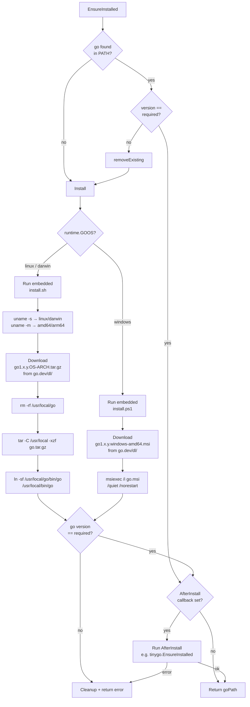

# Install Flow

## removeExisting

| Platform | Action |
|----------|--------|
| Linux / macOS | `rm -rf /usr/local/go` + `rm /usr/local/bin/go` |
| Windows | `msiexec /x {ProductCode} /quiet` or `Remove-Item C:\Go -Recurse` |

## Note on shell hash cache

After install the user's shell may have the old binary path cached.
The CLI prints `hash -r` as a reminder — cannot be automated from a subprocess.
